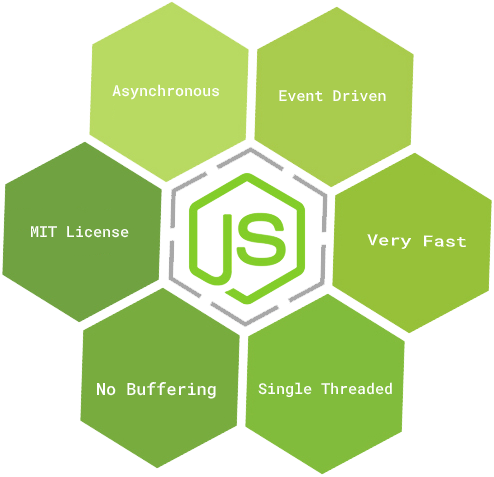

# [FR] Journal de Développement - Node.js

## 03/04/2024

### Progrès Réalisés

Aujourd'hui, j'ai entamé un nouveau cours sur Node.js.

Node.js est un environnement d'exécution JavaScript côté serveur construit sur le moteur JavaScript V8 de Chrome.

    

### Caractéristiques de Node.js

- **Très Rapide**: Node.js utilise le moteur V8 de Chrome, ce qui le rend très rapide.
- **Simple Fileté mais Hautement Évolutif**: Node.js utilise un modèle de programmation asynchrone basé sur les événements, ce qui le rend idéal pour les applications hautement évolutives.
- **Licence**: Node.js est publié sous la licence MIT.

### Composant de node.js

- Importer les modules requis: Nous utilisons le exiger directive pour charger les modules Node.js.

- Créer un serveur: Un serveur qui écoutera les requêtes du client similaires au serveur HTTP Apache.

- Lire la demande et la réponse de retour: Le serveur créé dans une étape précédente lira la requête HTTP faite par le client qui peut être un navigateur ou une console, puis retournera la réponse.

### Read Eval Print Loop (REPL)

**REPL** est un environnement interactif qui permet aux développeurs d'exécuter du code source de manière interactive et d'obtenir des résultats immédiats.

# [EN] Development Journal - Node.js

## April 03,2024

### Progress Achieved

Today, I embarked on a new course on Node.js.

Node.js is a server-side JavaScript execution environment built on the Chrome V8 JavaScript engine.

### Features of Node.js

### Components of Node.js

- Importing Required Modules: We use the `require` directive to load Node.js modules.

- Creating a Server: A server that will listen for client requests, similar to the HTTP Apache server.

- Reading Request and Returning Response: The server created in a previous step will read the HTTP request made by the client, which can be a browser or console, and then return the response.

### Read Eval Print Loop (REPL)

**REPL** is an interactive environment that allows developers to execute source code interactively and get immediate results.
